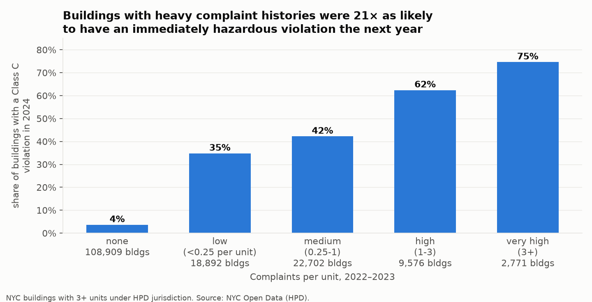
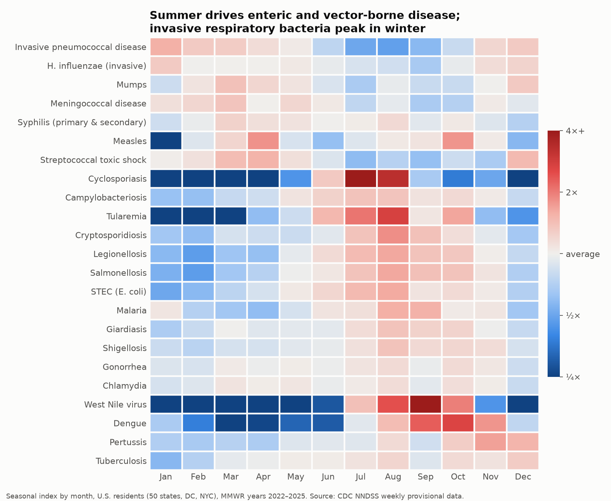
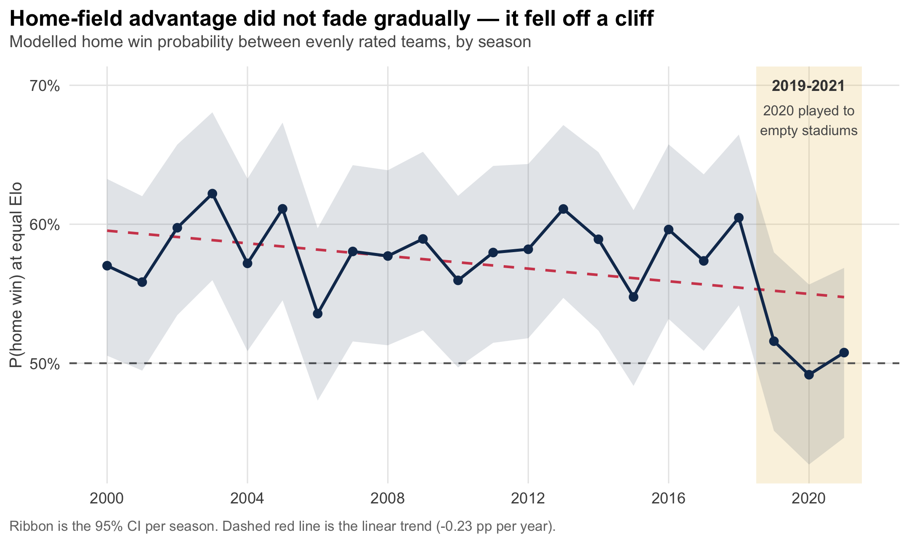

# Tapiwa Mutarimanja — Data Analytics Portfolio

M.S. Data Analytics & Visualization, Yeshiva University (May 2027, GPA 3.77) · B.Com (Hons) Information Systems · Jersey City, NJ

I take messy public data, clean and model it in **SQL** and **Python/R**, test what's actually going on, and turn it into recommendations that decision-makers can act on.

**Looking for:** data analyst internships and entry-level roles.
📧 tapiwanashemutarimanja@gmail.com · [LinkedIn](https://www.linkedin.com/in/tapiwa-mutarimanja-5b2674392)

---

## Projects

### 🏠 [NYC Housing: Do Tenant Complaints Predict Hazards?](https://github.com/TMutarimanja/nyc-housing-complaints-violations)
**SQL · Python · Tableau** · 5M+ NYC Open Data records

- Buildings with 3+ complaints per unit had a **75% chance of an immediately hazardous violation the following year**, vs 4% for buildings with none.
- **1% of buildings** generate **35%** of complaints and hazardous violations; the Bronx's hazard rate is **4.1×** Manhattan's.
- Recommendation: proactive pre-winter inspections of the ~2,800 highest-risk buildings.

---

### 🦠 [Disease Surveillance Data Warehouse](https://github.com/TMutarimanja/disease-surveillance-warehouse)
**PostgreSQL · dimensional modeling · ETL · Python** · 1.7M CDC rows

- 3-layer warehouse (staging → 3NF → star schema) with alias tables, an MMWR calendar and an ETL audit log; **reconciles to CDC's national totals to 0.00%**.
- Maps disease seasonality: enteric infections peak July–August, West Nile in September (5× an average month).
- Surfaced a **13× pertussis resurgence** (2022→2024) and a 2025 measles spike.

---

### 🛒 [Amazon Review Sentiment: Simple Beats Complex](https://github.com/TMutarimanja/amazon-reviews-sentiment-architecture)
**Python · scikit-learn · PyTorch · DistilBERT** · 4M reviews

- **F1 0.906 / ROC-AUC 0.966** on a locked 400k-review test set, with a leakage audit and 5-fold CV (±0.001).
- TF-IDF + linear SVM **outperformed fine-tuned DistilBERT** on the same data and trained **82× faster**, so I recommended the simpler model.

---

### 🏈 [NFL Home-Field Advantage Is Real — Then It Collapsed](https://github.com/TMutarimanja/nfl-elo-home-field-advantage)
**R · logistic regression · ggplot2** · 5,805 games

- Home teams won **58%** of evenly matched games through 2018, then about **50%** from 2019 to 2021 (likelihood-ratio test p = 0.0018). Co-authored with Rodney Chiwanga.
- Found and corrected a flaw in our own first model specification; out-of-sample AUC 0.69 on held-out seasons.

---

### ☁️ [Customer Feedback Sentiment Pipeline](https://github.com/TMutarimanja/customer-feedback-sentiment-pipeline)
**AWS (S3, Lambda, DynamoDB, SNS, API Gateway) · Python · CloudFormation**

- Event-driven, serverless pipeline: feedback file upload → sentiment scoring → dashboard → alerts on negative spikes.
- Evaluated the rule-based classifier (80% on labeled sample) and documented its failure modes: no stemming, no negation handling.

---

### 👶 [Bloom2gether: NYC Childcare Benefits Navigator](https://github.com/TMutarimanja/nyc-family-benefits)
**Product analytics · user research · A/B testing · Flask**

- 15 parent interviews identified cost as the #1 barrier; built a 5-question benefits screener.
- A/B test (N=100): engagement **41% → 53%** (+12 pp), mobile +20 pp.

---

## Skills

| | |
|---|---|
| **SQL** | PostgreSQL, SQLite: CTEs, window functions, views, star schemas, data validation |
| **Python** | pandas, NumPy, matplotlib, scikit-learn, Jupyter |
| **R** | dplyr, ggplot2, regression modelling, R Markdown |
| **BI & visualization** | Tableau, matplotlib, ggplot2, Excel |
| **Cloud & data engineering** | AWS (S3, Lambda, DynamoDB, SNS), ETL, CloudFormation, Git |

## Certifications in progress

Microsoft Power BI Data Analyst (PL-300) · Microsoft Azure Data Fundamentals (DP-900) · Neo4j Graph Data Science
